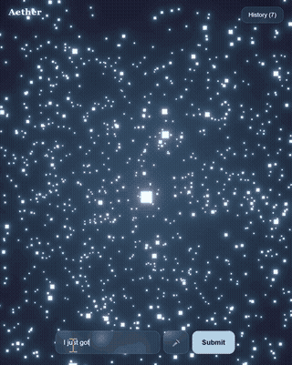

# Aether — AI Mood-to-World Generator

Aether turns how you're feeling into a living 3D world. Type or speak a thought, and an AI analyzes its emotional tone, then generates a unique particle universe - colour, motion, density, and a spoken narration - that visually embodies that mood in real time.

🔗 **Live demo**: https://aether-liard-nu.vercel.app
(Note: backend is ona free tier and may take ~30s to wake up on first load.)

## How it works

1. You type or speak how you're feeling
2. An LLM (via Groq) analyzes the text for valence, energy, and emotion category (with support for blended emotions - e.g. a proposal reads as both joy and love, not just one or the other)
3. A custom mapping function translates that analysis into a 3D scene config - colour, particle motion style, density, and speed
4. A React Three Fiber scene renders the result live, with bloom post-processing for a glowing, immersive feel
5. The AI's narration is displayed and read aloud via text-to-speech

## Tech Stack

1. **Frontend**
- React
- React Three Fiber
- Three.js
- @react-three/postprocessing
- Web Speech API

2. **Backend**: 
- FastAPI
- Groq API (Llama 3.3 70B)

3. **Deployment**: 
- Vercel (Frontend)
- Render (Backend)

## Key design decisions

- **Emotion modeling**: started with a 2D valence/energy model for colour, but found it couldn't distinguish emotions like anger vs. fear that share similar valence/energy. Solved by having the AI classify into named emotion categories with a primary/secondary blend, while keeping valence/energy to drive continuous motion physics - a hybrid of categorical and continuous modelling.
- **Motion design**: each mood quadrant (calm, joy, sadness, anger/fear) gets a distinct movement pattern (float, swirl, drift, jitter) rather than just changing speed, so different moods feel physically different, not just differently coloured.

## Known limitations

- Voice input requires Chroma or Edge (Web Speech API isn't supported in Firefox)
- Backend free tier sleeps after 15 min of inactivity - first request after idle time takes ~20-30s to respond.
- History is stored per-browser via localStorage (not synced across devices)

## Running locally

### backend
\`\`\`bash
cd aether-backend
python -m venv venv
venv\Scripts\activate
pip install -r requirements.txt
# create a .env file with GROQ_API_KEY=your_key
uvicorn main:app --reload
\`\`\`

### Frontend
\`\`\`bash
cd aether
npm install
npm run dev
\`\`\`